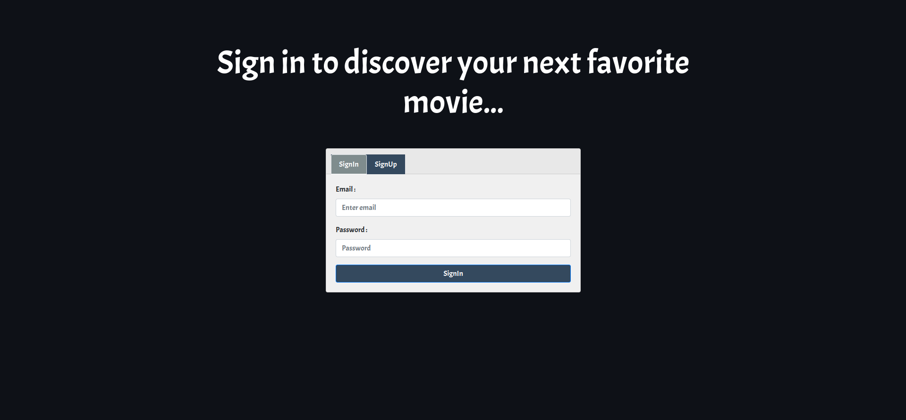
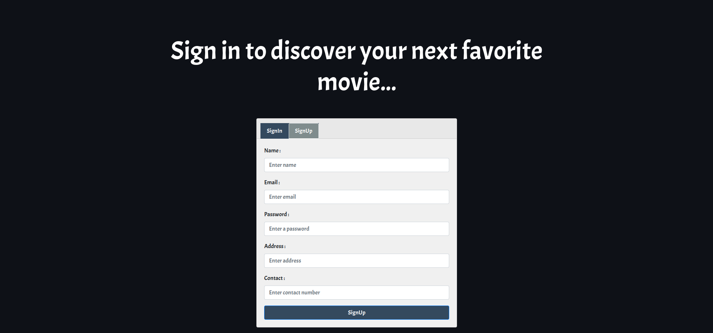
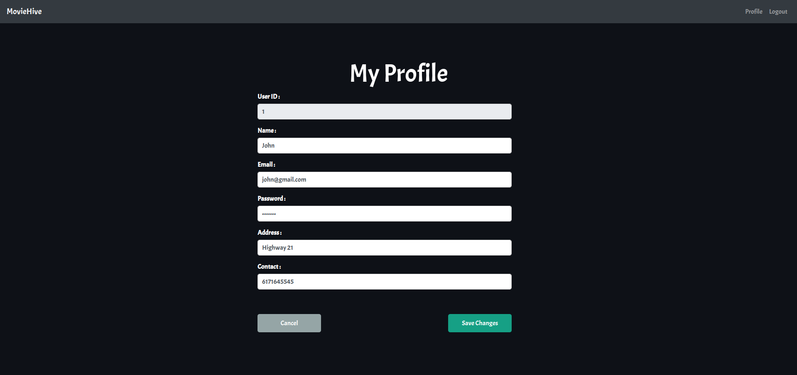
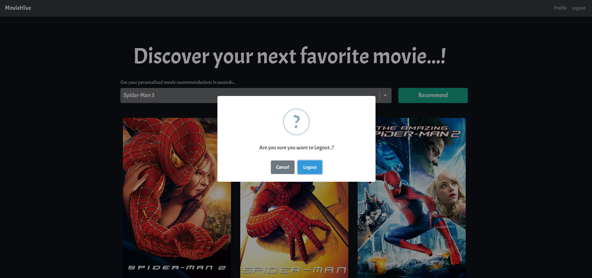

# Movie Recommendation System

 

#### Description

This project implements a simple <strong>content-based movie recommendation system</strong> that goes beyond basic metadata by leveraging multiple rich features including title, genre, plot summary, top cast, director, and keywords to improve recommendation quality.

Using datasets (tmdb_5000_movies.csv and tmdb_5000_credits.csv), the data is merged and processed into a unified format with a combined “tags” column that aggregates all relevant movie information.

#### Key steps include

- Data cleaning and transformation with Abstract Syntax Trees (AST) to refine genres, keywords, cast, and crew.
- NLP preprocessing such as lowercasing, stemming, and stop word removal for better text normalization.
- Text vectorization using CountVectorizer to convert movie tags into token matrices.
- Computing movie similarity with the Cosine Similarity algorithm to recommend movies based on content closeness.

This project highlights how enhanced metadata and NLP techniques can significantly improve content-based recommendation systems, providing users with more accurate and relevant movie suggestions.

 

## Technology Stack :

- HTML
- CSS
- JS
- Python
- Flask
- Docker
- AWS RDS (MySQL)
- AWS EC2

 

## Quick Links :

- [Presentation](https://docs.google.com/presentation/d/1Yr5TEE43U_bBhanu_IX5qf9oakWR_tjyga9uteLz9bo/edit?usp=sharing)
- [Hosted Link](http://44.204.156.245:5000)
- [Demo](https://drive.google.com/file/d/18LBMYA4ukBHpk1ZNRpq0AE7w4Gu19BKG/view?usp=sharing)
- [Docker Image](https://hub.docker.com/r/shinyisudocker2023/movie-recommendation-system)

 

   
   
   
   
   
